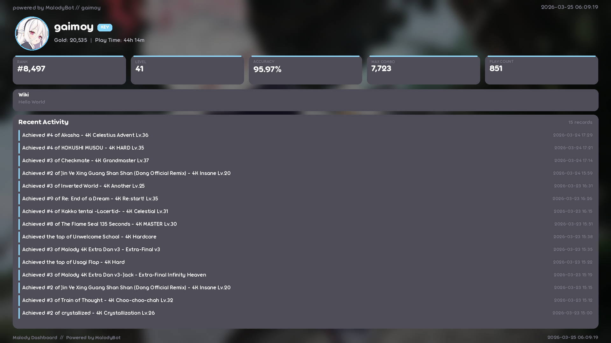
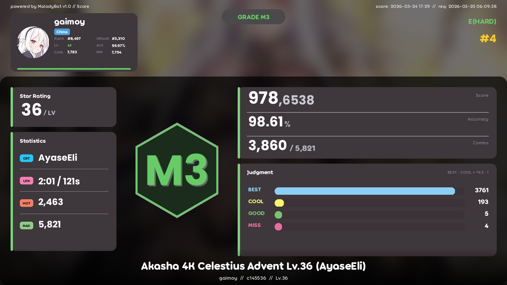
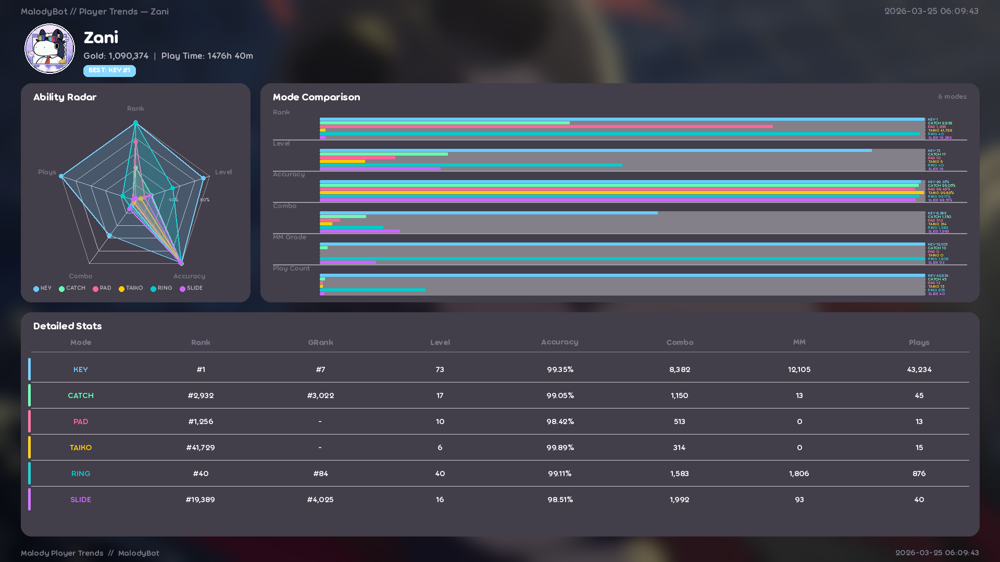

<div align="center">

# Malody API

**连接 [Malody](https://m.mugzone.net/) 并处理数据的API后端**

[](https://python.org)
[](https://fastapi.tiangolo.com)
[](https://pillow.readthedocs.io)
[](LICENSE)

</div>

---

## 图片演示

<table>
<tr>
<td align="center"><b>玩家信息看板</b></td>
<td align="center"><b>谱面成绩面板</b></td>
<td align="center"><b>玩家趋势分析</b></td>
</tr>
<tr>
<td></td>
<td></td>
<td></td>
</tr>
</table>

## 功能概览

| 功能 | JSON | 图片 | 说明 |
|:-----|:----:|:----:|:-----|
| 全局排行榜 | ✅ | ✅ | 支持 MM 值 / EXP 两种排名方式 |
| 网页排行榜 | ✅ | ✅ | 备用排行榜数据源 |
| 玩家信息看板 | ✅ | ✅ | 核心数据卡片 + Wiki + 最近活动 |
| 玩家趋势分析 | ✅ | ✅ | 雷达图 + 模式对比 + 数据表格 |
| 谱面成绩排行 | ✅ | ✅ | Top N 排行卡片列表 |
| 谱面成绩面板 | ✅ | ✅ | M5-M0 评级 + 判定分布 + 六边形封面 |
| 玩家 / 谱面搜索 | ✅ | — | 关键词模糊搜索 |
| 玩家活动记录 | ✅ | — | 最近游玩记录 |

## 关于仓库


## 快速开始

```bash
pip install -r requirements.txt
python run.py
```

服务启动于 `http://localhost:8080`，访问 `/docs` 查看 Swagger 交互式文档。

---

## API 端点

所有端点以 `/api` 为前缀。图片端点默认输出 JPEG，可通过 `fmt=png` 切换。

### 排行榜

| 端点 | 说明 | 主要参数 |
|:-----|:-----|:---------|
| `GET /api/rankings` | 网页排行榜（备用） | `mode` 模式 (0-9)，`limit` 数量 (1-200) |
| `GET /api/rankings/image` | 网页排行榜图片 | 同上 + `fmt` |
| `GET /api/ranking/global` | 全局排行榜 | `mode` 模式名/数字，`mm` 0=EXP/1=MM，`limit` (1-100) |
| `GET /api/ranking/global/image` | 全局排行榜图片 | 同上 + `fmt` |

### 玩家

| 端点 | 说明 | 主要参数 |
|:-----|:-----|:---------|
| `GET /api/player/{identifier}` | 玩家完整信息 | 用户名或 UID |
| `GET /api/player/{identifier}/image` | 玩家信息看板图片 | `mode` 留空自动选最高排名，`fmt` |
| `GET /api/player/{identifier}/activity` | 最近活动记录 | `limit` (1-50) |
| `GET /api/player/search/{keyword}` | 搜索玩家 | `limit` (1-50) |

### 玩家趋势分析

| 端点 | 说明 | 主要参数 |
|:-----|:-----|:---------|
| `GET /api/analytics/player-trends/{identifier}` | 各模式数据 (JSON) | `mode` 筛选指定模式 |
| `GET /api/analytics/player-trends/{identifier}/image` | 趋势分析图片 | `mode`，`fmt` |

趋势分析图片包含：
- **能力雷达图** — Rank / Level / Accuracy / Combo / Plays 五维对比
- **模式对比条形图** — 各模式 6 项指标横向对比
- **详细数据表格** — 所有模式的完整数值

### 谱面

| 端点 | 说明 | 主要参数 |
|:-----|:-----|:---------|
| `GET /api/chart/{cid}` | 谱面成绩排行 | `limit` (1-100)，cid 支持 `c154498` 或 `154498` |
| `GET /api/chart/{cid}/image` | 谱面排行图片 | `limit`，`fmt` |
| `GET /api/chart/{cid}/player/{identifier}` | 指定玩家谱面成绩 | — |
| `GET /api/chart/{cid}/player/{identifier}/image` | 成绩面板图片 | `fmt` |
| `GET /api/charts/search` | 搜索谱面 | `word` 关键词，`mode`，`limit` |

成绩面板图片包含：
- M5-M0 评级 + Judge 等级 (A-E) + Pro 标识
- 分数 / 准确率 / Combo 详情
- BEST / COOL / GOOD / MISS 判定分布条
- 六边形封面 + Star Rating + Statistics
- 玩家全局排名信息

---

## 游戏模式

| 参数 | 模式 | 参数 | 模式 |
|:-----|:-----|:-----|:-----|
| `key` / `0` | Key | `taiko` / `5` | Taiko |
| `catch` / `3` | Catch | `ring` / `6` | Ring |
| `pad` / `4` | Pad | `slide` / `7` | Slide |
| | | `live` / `8` | Live |
| | | `cube` / `9` | Cube |

`mode` 参数支持名称（不区分大小写）或数字。留空时自动选择排名最高的模式。

## 评级系统

| 等级 | 条件 | 等级 | 条件 |
|:-----|:-----|:-----|:-----|
| **M5** | 全 BEST，准确率 100% | **M2** | 准确率 ≥ 80% |
| **M4** | 无 MISS，准确率 ≥ 95% | **M1** | 准确率 ≥ 70% |
| **M3** | 准确率 ≥ 90% | **M0** | 准确率 < 70% |

判定等级：`A`(EASY) → `B`(EASY+) → `C`(NORMAL) → `D`(NORMAL+) → `E`(HARD)

## 响应格式

```json
// 成功
{
  "success": true,
  "data": { ... },
  "message": "描述信息",
  "timestamp": "2026-03-25T12:00:00.000000"
}

// 错误
{
  "success": false,
  "error": "错误描述",
  "timestamp": "2026-03-25T12:00:00.000000"
}
```

## 项目结构

```
malody_api/
├── run.py                          # 入口
├── malody_client.py                # Malody API 客户端
├── requirements.txt
├── routers/
│   └── api.py                      # 全部 API 路由
├── image/
│   ├── renderer.py                 # 渲染工具 (背景/渐变/圆角)
│   ├── colors.py                   # 颜色常量
│   ├── fonts.py                    # 字体加载
│   ├── panels/
│   │   ├── panel_dashboard.py      # 玩家信息看板
│   │   ├── panel_score.py          # 谱面成绩面板
│   │   ├── panel_trends.py         # 趋势分析面板
│   │   └── panel_card_list.py      # 排行榜卡片列表
│   └── components/
│       ├── avatar.py               # 头像组件
│       ├── player_card.py          # 玩家卡片
│       ├── text.py                 # 文字渲染
│       └── banner.py               # 横幅组件
├── assets/
│   ├── fonts/
│   └── images/
└── demo/                           # 演示图片
```

## 技术栈

| 组件 | 说明 |
|:-----|:-----|
| [FastAPI](https://fastapi.tiangolo.com) + Uvicorn | 异步 Web 框架 |
| [Pillow](https://pillow.readthedocs.io) | 图片生成与渲染 |
| [aiohttp](https://docs.aiohttp.org) / [httpx](https://www.python-httpx.org) | 异步 HTTP 请求 |
| [BeautifulSoup4](https://www.crummy.com/software/BeautifulSoup/) | 网页数据解析 |

## 鸣谢

- [yumu-image](https://github.com/yumu-bot/yumu-image) — 图片面板样式与布局参考
- [malody_api (ChuanYuanNotBoat)](https://github.com/ChuanYuanNotBoat/malody_api/) — Malody API 设计参考
- [Malody](https://malody.mugzone.net/) — 游戏数据来源
- [baimg](https://img.catcdn.cn/) — 背景图床

## License

[MIT](LICENSE)
